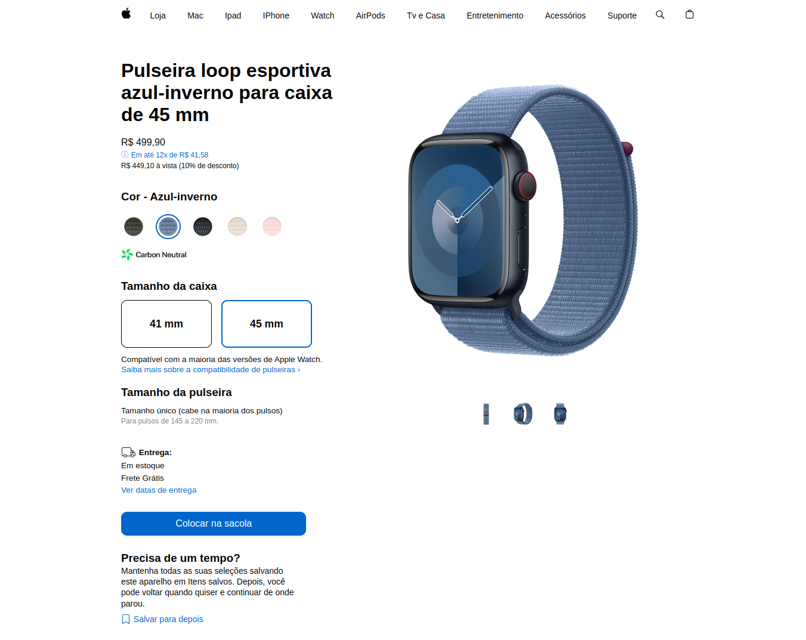

<h1 align="center">🍎 Hashtag Apple Watch ⌚</h1>

  

 

## Tópicos
- [Imagem do projeto](#img)
- [Acesso ao projeto](#acesso)
- [Sobre o projeto](#sobre)
- [Tecnologias utilizadas](#tec)
- [Status do projeto](#status)  
- [Licença](#license)

 

<h2 id="img">🖼️ Imagem do projeto</h2>

 

<h2 id="acesso">🔗 Acesso ao projeto</h2>

Clique [aqui](https://fel1324.github.io/HashtagAppleWatch/) para acessar o projeto

 

<h2 id="sobre">📖 Sobre o projeto</h2>

  Hashtag Apple Watch é um clone do site de vendas de Apple Watch.

 

<h2 id="tec">🧨 Tecnologias utilizadas</h2>

* HTML e CSS
* Javascript
* Git e Github

 

<h2 id="status">🚧 Status do projeto</h2>

Projeto finalizado ✅

 

<h2 id="license">📝 Licença</h2>

O projeto está sob a licença MIT.
